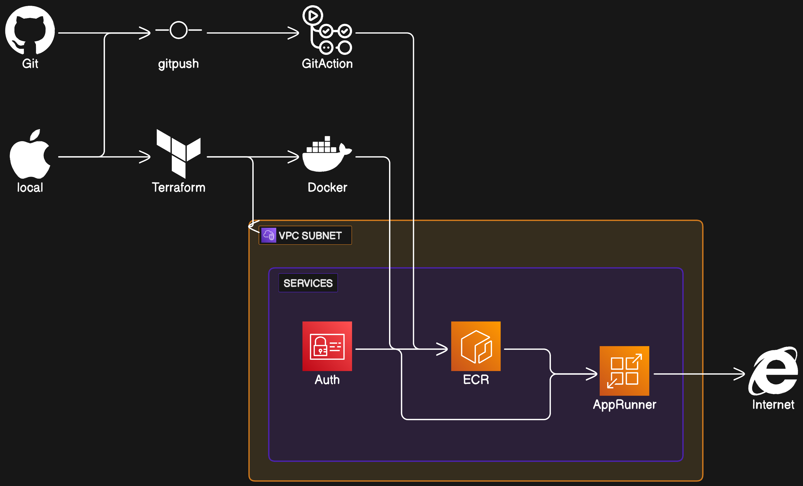
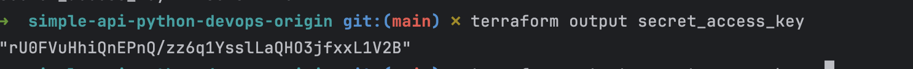

# Simple Web App Deployment on AWS using Docker

## Architecture

The objective of this project is to deploy a web application as a Docker container on AWS, making it accessible via the public internet.
The original requeriments are in https://franciscomosquera.com/2024/01/13/project-2-infrastructure-provisioning-automation/ 

## Requirements

1. **Web App**: Create a simple web app Python app and ploy .
2. **Dockerization**: Dockerize the app and create a Dockerfile with instructions for building a Docker image of the app.
3. **DockerHub Account**: If not already owned, create one to push the Docker image.
4. **Build Docker Image**: Use Docker Buildx tool to build the image in both x86_64 and arm64 formats, then push it to your DockerHub registry(We changed it to Amazon ECR, previous approval).
5. **AWS Deployment**: Deploy the container on AWS by creating and launching an EC2 instance that will host the app container. Ensure the container is accessible over the public internet y(We changed it to Amazon AppRunner, previous approval)..

## Getting Started

These instructions will guide you on how to deploy your web app on AWS.

### Prerequisites

- Docker installed on your local machine.
- DockerHub account.
- Terraform
- GitHub Actions
- Git
- aws CLI 
- AWS account in the .config file.

### Steps

1. **Web App**: Fork the https://github.com/maxiplux/simple-api-python-devops.git in your GitHub Account
2. **Download the code and execute locally**:
3.    terraform init
4.    terraform apply -auto-approve
5.    Copy the access_key_id value, and then export secret key with the command "terraform output secret_access_key"
6.    
 

## Built With

- Docker
- AWS
- Docker Buildx
## Key Components

- **Terraform Providers Configuration**: Specifies the required versions for the AWS and null providers.
- **AWS Provider Setup**: Configures the AWS provider for the us-east-1 region and applies default tags to each resources.
- **Random IDs**: Generates a unique service name and a random integer for service identification, because of eventual consitency in AWS sometimes the API can save old services name and we can experience some errors.
- **IAM User and Access Key**: IAM user and an access key for AWS services interaction, the terraform here is going to create a unique account with the permission to execute ECR and AppRunner only.
- **IAM Policies Attachment**: Attaches necessary policies to the IAM user for App Runner, and ECR Container Registry.
- **ECR Repository**: Creates an ECR repository for the Docker image ( private seeting with Access key and Client Credentials).
- **Docker Image Deployment**: Hacks with null resource, and a local-exec provisioner to build and push a Docker image to the ECR repository.
- **Outputs**: Various outputs including the ECR repository URL and IAM access credentials, don't execuite it in enterprise enviroments without a deep understanding.
- **IAM Role for App Runner**: Creates an IAM role for the App Runner service to access ECR.
- **App Runner Service**: Sets up an App Runner service to deploy the application, and enable automatic deployments from Github Actions.
## Suggestions and Considerations

- **Security Best Practices**: The  script here are can expose sensitive information in your terminal, such as the IAM secret access key. Terraform marks this as sensitive, which is good, but ensure that access to Terraform state files and logs is securely managed.
- **IAM Role and Policies**: Each services here has a separated permissions by creating specific IAM roles and policies for different components. Review the principle of least privilege to ensure no excess permissions are granted.
- **Docker Image Build and Push**: The main challenges was deploying ARM images to App Runner and the resolution at the end was switch to amd64. This is an important consideration for cross-platform compatibility. Make sure the Dockerfile supports multi-platform builds if necessary( This is something easy with GitHub Actions).

- **Cleanup and Resource Management**: The terrafrom script includes commented commands for destroying resources. Ensure that resource lifecycle management is considered, especially for resources that may incur costs.

## Authors

  - Lara
  - Farius
  - Rakin
  - Juan

## License

This project is licensed under the MIT License - see the LICENSE.md file for details
